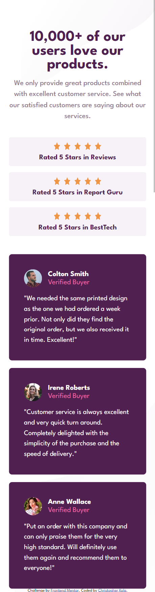

# Frontend Mentor - Social proof section solution

This is my solution to the [Social proof section challenge on Frontend Mentor](https://www.frontendmentor.io/challenges/social-proof-section-6e0qTv_bA). Frontend Mentor challenges help you improve your coding skills by building realistic projects.

## Table of contents

- [Overview](#overview)
  - [The challenge](#the-challenge)
  - [Screenshot](#screenshot)
  - [Links](#links)
- [My process](#my-process)
  - [Built with](#built-with)
  - [What I learned](#what-i-learned)
  - [Continued development](#continued-development)
  - [Useful resources](#useful-resources)
- [Author](#author)
- [Acknowledgments](#acknowledgments)

## Overview

### The challenge

Users should be able to:

- View the optimal layout for the section depending on their device's screen size

### Screenshot

#### Desktop


#### Mobile


### Links

- Solution URL: [Add solution URL here](https://your-solution-url.com)
- Live Site URL: [Add live site URL here](https://your-live-site-url.com)

## My process

### Built with

- Semantic HTML5 markup
- CSS custom properties
- Flexbox
- CSS Grid

### What I learned

In this project I learned how to properly position background images look below on how I managed this:

```CSS

body {
		display: grid;
		margin-inline: 1.5rem;
		max-width: 25rem;
		place-items: center;
		background: url(./images/bg-pattern-top-mobile.svg) top left 3.5rem, url(./images/bg-pattern-bottom-mobile.svg) bottom right;
		background-repeat: no-repeat;
	}

```

### Continued development

I really want to improve my layout skills as this challenge really CHALLENGED me and I feel my code is still a bit janky and isn't perfect on every screen therefore I need to work on my flexbox and grid understanding and skills.

### Useful resources

- [MDN](https://developer.mozilla.org/en-US/) - this website is what I used to make sure I used the correct selectors and available properties.
- [ChatGPT](https://chatgpt.com) - I used chatgpt for small queries about my code where I couldn't necessarily see issues.

## Author

- Frontend Mentor - [@Ckola99](https://www.frontendmentor.io/profile/Ckola99)
- Twitter - [@koladev01](https://www.twitter.com/koladev01)


## Acknowledgments

No acknowledgements this time maybe an acknowledgement to myself because I fought to finish and also a bit of a shout out to chatGPT.
